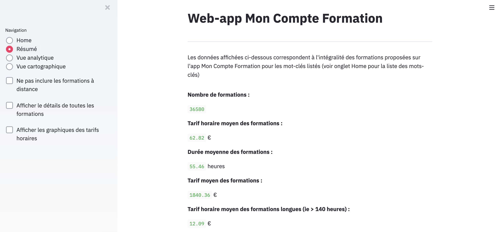
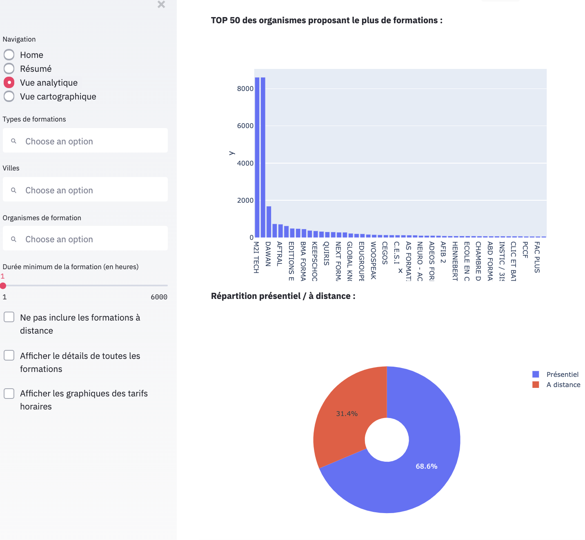
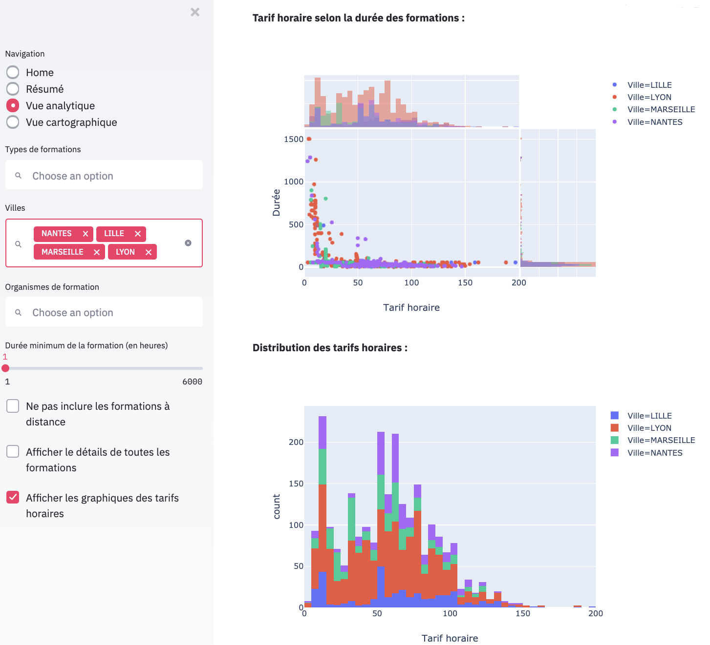
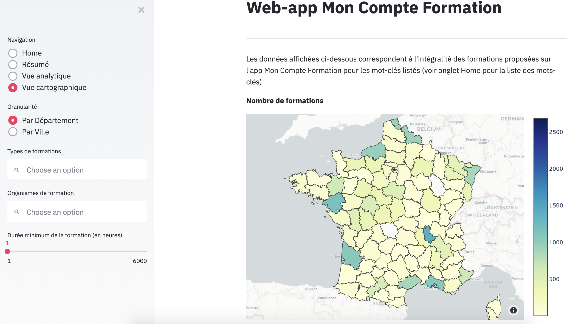
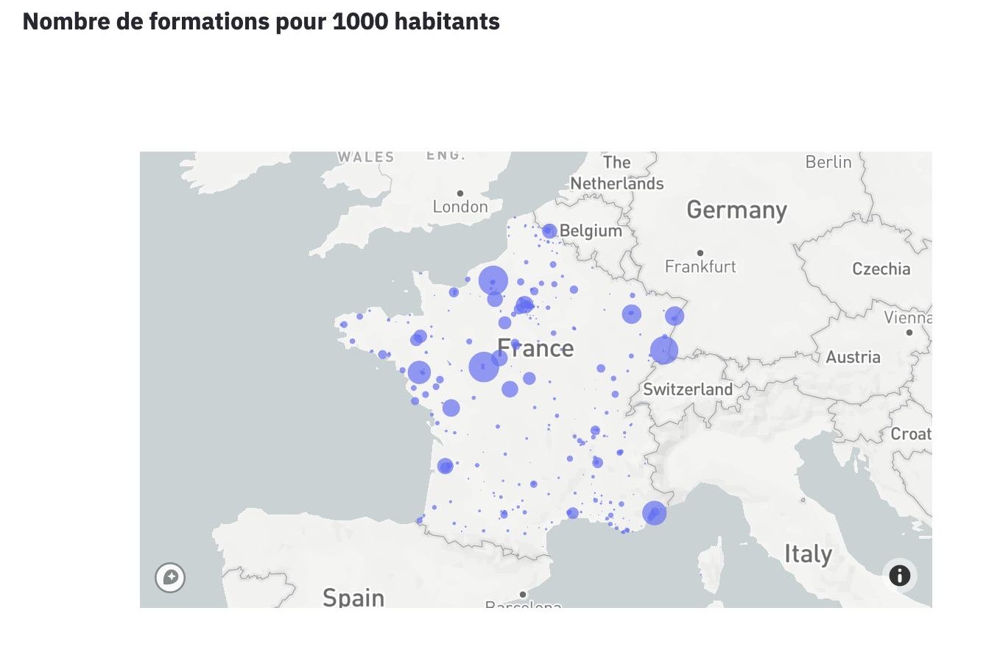

# Web app "Mon Compte Formation"

Web app providing a statistical analysis of French digital training courses offered on the website / mobile app "Mon Compte Formation", launched in November 2019 by the French Governement.

Data source : https://www.moncompteformation.gouv.fr/

## How’s it work?

1. Clone GitHub repo
```
git clone https://github.com/jeremieperes/french-training-courses
```
2. Install required python packages :
```
cd path/to/project/directory
pip install -r requirements.txt
```
3. Sign up on [Mapbox](https://account.mapbox.com/) and create a token

4. Create a file ".mapbox_token" and copy your Mapbox token in it. Put this file in the root folder of the repo.

4. Run the streamlit command line
```
streamlit run app/Formation-web-app.py
```

*Note : it may take up to 15 minutes to load data for the first time*

## Screenshots

* **KPIs**




* **Filtered View**



* **Cartographic View**



